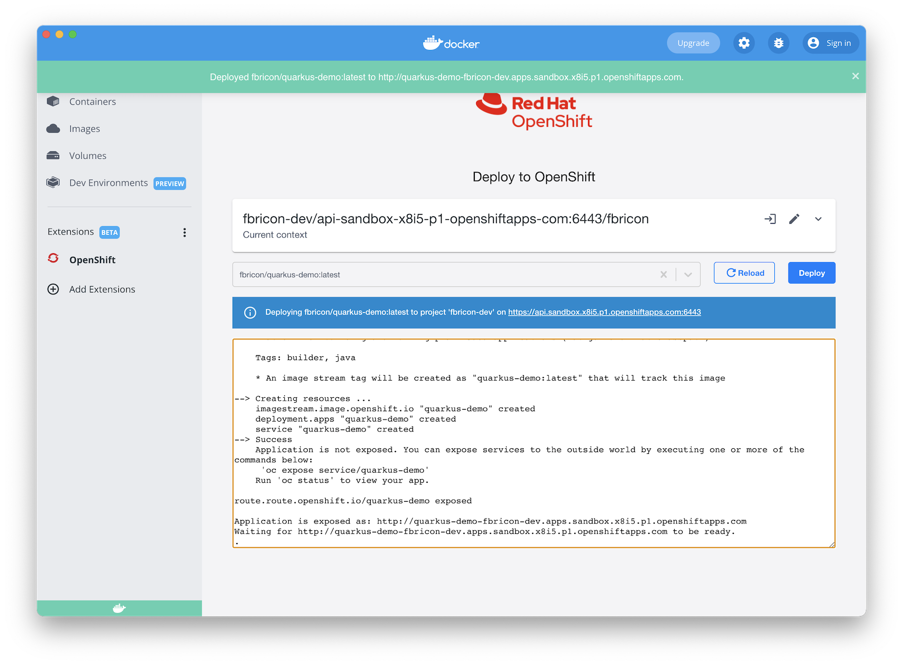

# OpenShift Extension for Docker Desktop

The _Red Hat OpenShift extension for Docker Desktop_ enables developers who are working with [OpenShift](https://www.redhat.com/en/technologies/cloud-computing/openshift) to deploy and test their applications from Docker Desktop with ease.

You choose your target environment, the project you want to deploy to, you select the image of your app from the ones available on Docker Desktop and it deploys the application on OpenShift.

Capabilities provided at the moment:

- **Detection of Kubernetes environments:** scan your defined kubeconfigs on your local environment and preselect your current default kubernetes environment. You can also easily switch from one environment to another one.
- **Login into Clusters:** you can connect to a new Kubernetes environment not yet configured on your local workstation by directly connecting to it with the connection details.
- **Listing of projects (namespace):** browse and select the project in which you want to deploy your application.
- **Selection of container image:** pick and choose the container image you already have built and deployed on a container registry.
- **Deployment of container image:** container image gets deployed by building the resources needed with the automatic creation of the route to expose the application outside of the cluster. Once deployed, the application opens in a new browser tab.

## Building locally

See API doc here: https://github.com/docker/extensions-sdk/tree/main/docs/dev/api

- Build with `make build-extension`
- Install extension with `make install-extension`
- Uninstall extension with `make uninstall-extension`
- start local web server with `cd client; yarn start`
- make extension use local web server with `docker extension dev ui-source redhatdeveloper/openshift-dd-ext http://localhost:3000`
- close and reopen Docker dashboard.
- changes to React code will be reflected in the UI on file save automatically.

## Feedback

- Have a question? Start a discussion on [GitHub Discussions](https://github.com/redhat-developer/openshift-dd-ext/discussions),
- File a bug in [GitHub Issues](https://github.com/redhat-developer/openshift-dd-ext/issues)

## License

MIT License, see [LICENSE](LICENSE) for more information.
